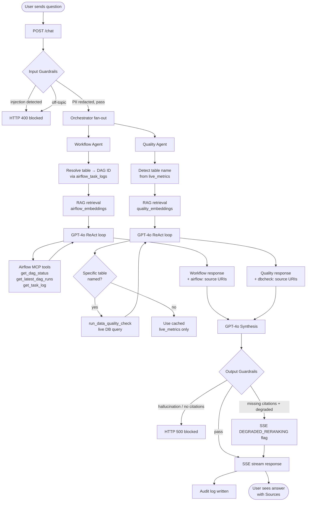
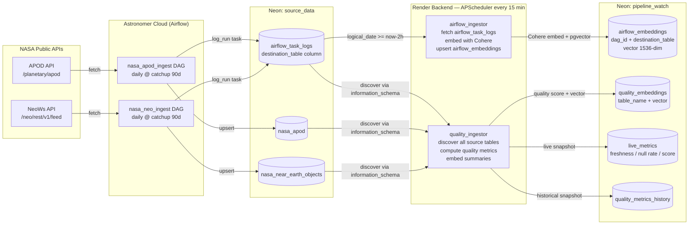

# Pipeline Observability Agent

A conversational AI system for monitoring data pipeline health. Users ask natural-language questions about Airflow DAG runs and data quality, and the system answers by combining live Airflow API calls, pre-computed quality metrics, and vector-search over historical run logs — all synthesized by GPT-4o.

---

## Intent

Data engineers spend significant time checking dashboards, digging through Airflow logs, and cross-referencing quality metrics to answer questions like:

- "What did the `nasa_neo_ingest` DAG do on its last run?"
- "How fresh is the data in `nasa_near_earth_objects`?"
- "Were there any failures in the past 24 hours?"

This system makes those answers available through a chat interface, with full source attribution and guardrails to prevent prompt injection and hallucinated responses.

---

## Architecture Overview

```
┌─────────────────────────────────────────────────────────────┐
│                        Vercel (Frontend)                     │
│                  React / Next.js chat UI                     │
└───────────────────────────┬─────────────────────────────────┘
                            │  HTTPS  POST /chat  (SSE)
                            ▼
┌─────────────────────────────────────────────────────────────┐
│                    Render (Backend API)                      │
│                       FastAPI + uvicorn                      │
│                                                             │
│  ┌─────────────┐   ┌──────────────┐   ┌─────────────────┐  │
│  │   Input     │   │ Orchestrator │   │    Output       │  │
│  │ Guardrails  │──▶│  (LangGraph) │──▶│  Guardrails     │  │
│  │ PII redact  │   │  60s timeout │   │ Hallucination   │  │
│  │ Injection   │   │  fan-out     │   │ Citation check  │  │
│  │ Topic class │   └──────┬───────┘   └─────────────────┘  │
│  └─────────────┘          │                                  │
│                    ┌──────┴──────┐                          │
│                    ▼             ▼                           │
│          ┌──────────────┐  ┌──────────────┐                 │
│          │   Workflow   │  │   Quality    │                 │
│          │    Agent     │  │    Agent     │                 │
│          │  (GPT-4o)    │  │  (GPT-4o)    │                 │
│          └──────┬───────┘  └──────┬───────┘                 │
│                 │                 │                          │
│          ┌──────▼──────┐  ┌──────▼───────┐                 │
│          │ Airflow MCP │  │  DB Quality  │                 │
│          │   Server    │  │    Tool      │                 │
│          │  (stdio)    │  │  (asyncpg)   │                 │
│          └──────┬───────┘  └──────┬───────┘                 │
│                 │                 │                          │
│          ┌──────▼──────────────────▼──────┐                 │
│          │         RAG Layer              │                 │
│          │  Cohere embed + pgvector HNSW  │                 │
│          │  Hybrid dense+BM25 retrieval   │                 │
│          └────────────────────────────────┘                 │
│                                                             │
│          ┌─────────────────────────────────┐                │
│          │    APScheduler (every 15 min)   │                │
│          │  airflow_ingestor               │                │
│          │  quality_ingestor               │                │
│          └─────────────────────────────────┘                │
└─────────────────────────────────────────────────────────────┘
                   │                    │
       ┌───────────▼──────┐   ┌─────────▼──────────┐
       │  Neon: source_data│   │ Neon: pipeline_watch│
       │  nasa_near_earth  │   │ airflow_embeddings  │
       │  _objects         │   │ quality_embeddings  │
       │  nasa_apod        │   │ live_metrics        │
       │  airflow_task_logs│   │ quality_metrics_    │
       │                  │   │ history             │
       └──────────────────┘   │ audit_log           │
                              └─────────────────────┘
                                         ▲
                              ┌──────────┴──────────┐
                              │  Astronomer Cloud    │
                              │  nasa_neo_ingest DAG │
                              │  nasa_apod_ingest DAG│
                              └─────────────────────┘
```

---

## Chat Query Flow



---

## Ingestion and Embedding Flow



---

## Components

### Airflow DAGs (`airflow/dags/`)

| DAG | Source | Destination table | Schedule |
|-----|--------|-------------------|----------|
| `nasa_neo_ingest` | NASA NeoWs API | `nasa_near_earth_objects` | Daily, catchup 90 days |
| `nasa_apod_ingest` | NASA APOD API | `nasa_apod` | Daily, catchup 90 days |

Each DAG has two tasks: `fetch_and_load` (upsert via `ON CONFLICT DO UPDATE`) and `log_run` (writes a summary row to `airflow_task_logs` including a `destination_table` column used by the workflow agent to resolve table names to DAG IDs).

### Backend API (`backend/`)

| Module | Purpose |
|--------|---------|
| `api/chat.py` | SSE streaming endpoint, rate limiting (10 req/min), audit logging |
| `api/status.py` | Dashboard data — live metrics + DAG last-run states |
| `api/admin.py` | `POST /admin/backfill-airflow-embeddings` — one-time full re-embed |
| `api/health.py` | Liveness probe |

### Orchestrator (`agents/orchestrator.py`)

Fans both sub-agents out in parallel with a 60-second timeout. On completion, GPT-4o synthesizes their outputs into a single prose response. If either agent times out or throws, the synthesizer acknowledges the partial outage without incorporating error text as facts.

### Workflow Agent (`agents/workflow_agent.py`)

Resolves the query's table name to a DAG ID (checking `_KNOWN_DAG_IDS` first, then `airflow_task_logs.destination_table`, then a regex fallback). Retrieves relevant historical run context from `airflow_embeddings`, then runs a GPT-4o ReAct loop with four Airflow MCP tools.

### Quality Agent (`agents/quality_agent.py`)

Reads `live_metrics` for a summary of all monitored tables. When a specific table is named, it also runs a live `run_data_quality_check` against the source DB (gated by a semaphore). Historical context comes from `quality_embeddings`.

### Airflow MCP Server (`airflow_mcp/server.py`)

A FastMCP stdio subprocess exposing four tools to the workflow agent:

| Tool | Description |
|------|-------------|
| `ping` | Liveness probe — no side effects |
| `get_dag_status` | Current DAG metadata and most recent run state |
| `get_latest_dag_runs` | Recent run history with states and timing |
| `get_latest_task_try` | Highest try number for a task instance |
| `get_task_log` | Paginated task-level logs |

### RAG Layer (`rag/`)

Hybrid retrieval: Cohere `embed-english-v3.0` for dense vectors stored as `VECTOR(1536)` with HNSW index, combined with PostgreSQL BM25 full-text search (`tsvector`). Results are optionally reranked by Cohere's rerank API. Falls back gracefully if reranking is unavailable.

### Guardrails (`guardrails/`)

**Input:** Presidio PII redaction → regex injection pattern detection → GPT-4o-mini topic classification (fails open on error to avoid blocking legitimate queries).

**Output:** Hallucination check verifying that all claims in the response can be traced to agent-retrieved context; citation check ensuring at least one `airflow:` or `dbcheck:` source URI is present.

### Ingestion (`ingestion/`)

APScheduler runs two jobs every 15 minutes on startup:

- **`airflow_ingestor`** — fetches `airflow_task_logs` rows from the last 2 hours, embeds each with Cohere, upserts into `airflow_embeddings` (including `destination_table` for structured filtering).
- **`quality_ingestor`** — auto-discovers all tables in `source_data` via `information_schema`, computes freshness/null-rate/schema-drift scores, writes to `live_metrics`, `quality_metrics_history`, and `quality_embeddings`.

---

## Databases

### `pipeline_watch` (Neon) — observability store

| Table | Contents |
|-------|----------|
| `airflow_embeddings` | Cohere vectors of Airflow task logs; columns: `dag_id`, `destination_table`, `source_uri` |
| `quality_embeddings` | Cohere vectors of quality metric summaries; column: `table_name` |
| `live_metrics` | Latest quality snapshot per table (refreshed every 15 min) |
| `quality_metrics_history` | Full history of quality metric snapshots |
| `audit_log` | Every chat request with redacted query, guardrail outcome, and HMAC-hashed API key |

### `source_data` (Neon) — pipeline data

| Table | Contents |
|-------|----------|
| `nasa_near_earth_objects` | Near-Earth asteroid close-approach data from NASA NeoWs |
| `nasa_apod` | NASA Astronomy Picture of the Day records |
| `airflow_task_logs` | DAG run summaries written by each DAG's `log_run` task; includes `destination_table` |

---

## Deployment

| Component | Platform | Trigger |
|-----------|----------|---------|
| Backend API | Render (Docker, standard plan) | Auto-deploy on `main` push via `render.yaml` |
| Frontend | Vercel | Auto-deploy on `main` push |
| Airflow DAGs | Astronomer Cloud | `astro deploy <deployment-id> --dags -f` |

Environment variables (set in Render dashboard): `DATABASE_URL`, `SOURCE_DATABASE_URL`, `OPENAI_API_KEY`, `COHERE_API_KEY`, `AIRFLOW_BASE_URL`, `AIRFLOW_TOKEN`, `AUDIT_HMAC_SECRET`, `API_KEY`, `FRONTEND_ORIGIN`.
