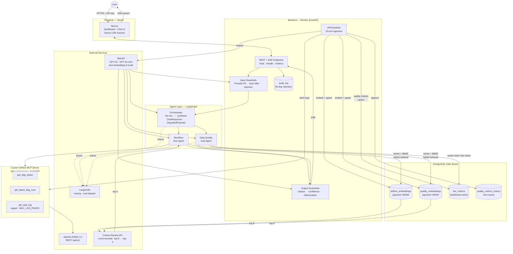

# Pipeline Observability Agent — Design Spec

**Date:** 2026-04-22 (revised post-grader feedback)
**Project:** AI Engineering Bootcamp Capstone

---

## Business Problem

Data engineering teams lose significant time triaging pipeline failures and data quality issues reactively — they discover problems after downstream consumers are already affected. There is no single place to ask "what broke, why, and is the data trustworthy?" without manually checking Airflow logs and running ad-hoc database queries.

This system provides an AI-powered observability layer that monitors both Apache Airflow workflow execution and database data quality in real time, and allows engineers to interrogate the state of their pipelines in natural language.

---

## System Overview

A Next.js frontend (deployed on Vercel) provides a split-view dashboard and chat interface. A FastAPI backend orchestrates a multi-agent system built with LangGraph. An Orchestrator Agent delegates to two specialized sub-agents that run in parallel — one for workflow monitoring, one for data quality monitoring. All agent activity is traced in LangSmith. Guardrails AI protects both input and output.

---

## Architecture Diagram

> Renders natively on GitHub. Export to PNG via [Mermaid Live Editor](https://mermaid.live) or the VS Code Mermaid extension.



**Quick-read summary of the diagram above:**

```
User ──HTTPS──▶ Next.js ◀──▶ FastAPI
                                │
                          Input Guardrails (Presidio)
                                │
                         LangGraph Orchestrator
                        ┌───────┴────────┐
                  Workflow SA      Data Quality SA
                  (30s timeout)    (30s timeout)
                        │                │
              Airflow MCP (stdio)   live_metrics cache
                        │           quality_embeddings
              airflow_embeddings         │
                        │         Cohere Rerank
              Cohere Rerank              │
                        └───────┬────────┘
                          Output Guardrails
                                │
                           SSE → User

APScheduler ──▶ MCP ──▶ airflow_embeddings
            └──▶ DB  ──▶ live_metrics / quality_metrics_history

LangSmith traces everything in the agent layer (dashed lines)
```

---

## Decisions Resolved (from grader feedback)

| Decision | Choice | Rationale |
|---|---|---|
| Airflow integration path | Custom MCP server wrapping Airflow 3.x REST API (`/api/v1/`), running as a stdio subprocess | Airflow 2.x reached end-of-life on 2026-04-22. The community MCP server (`mcp-server-apache-airflow` v0.2.10) has broken log retrieval on Airflow 3 (issue #50 — content field returns list instead of string). A thin custom MCP server built with the `mcp` Python SDK's `FastMCP` class wraps `apache-airflow-client` directly, fixes the Airflow 3 response handling, and exposes tools via stdio transport (no extra deployment service). `langchain-mcp-adapters` auto-converts the tools for LangGraph agents. Note: despite Airflow 3.x being a major release, the stable REST API endpoint is still `/api/v1/` — the generated `apache-airflow-client==3.0.*` targets `/api/v1/`. |
| Primary data warehouse | PostgreSQL | Simpler for capstone scope; avoids Redshift billing and connection complexity. Redshift noted as a production extension path. |
| FastAPI hosting | Render | Supports persistent SSE connections, no Lambda cold-start surprises, straightforward environment variable management. |
| Agent framework | LangGraph (replaces plain LangChain parallel tools) | Provides a deterministic state machine with explicit fan-out/fan-in, per-agent cancel/timeout, and standardized error payloads. |
| pgvector index type | HNSW, cosine distance, pgvector ≥ 0.5 | Best recall/performance balance for 1,000–10,000 vectors at this scale. |
| Auth/RBAC | API key header for capstone scope | SSO/OAuth noted as a production enhancement; out of scope for demo. |

---

## Architecture

### Frontend (Next.js — Vercel)

- **Dashboard panel (left/main):** DAG status cards (success/failed/running), data quality scores per table, recent alert feed, "last updated" timestamp per metric and per DAG card, trend sparklines
- **Chat panel (right sidebar):** Conversational interface for natural language queries; streams responses with clickable inline citations; thumbs-up/thumbs-down feedback captures which specific citations supported the answer
- **Source URI resolver:** client-side utility maps structured source IDs to deep links — `airflow:dag=.../task=.../run=.../try=.../ts=...` opens the Airflow log viewer with `dag_id`, `run_id`, `task_id`, and `try_number` pre-filled; `dbcheck:table=.../metric=.../ts=...` opens a presigned S3 link to the raw log fragment in object storage. **Presigned URL security:** URLs are minted server-side only (the backend calls S3/GCS sign API using the `object_key` from the embedding row, then returns the signed URL to the client — never exposing IAM credentials or the underlying object key); TTL: 60–120 s, scoped to the exact `object_key`; every grant is logged to `audit_log` with `api_key_id` and `object_key` for forensic access tracking.
- **Log viewer toggle:** the log viewer defaults to the **sanitized** snippet (PII-redacted text from `airflow_embeddings.text`); a "View raw log" toggle fetches the full paginated log via a freshly minted presigned URL. Sanitized view is the default to prevent accidental PII exposure in shared screen or screenshot contexts.
- Base: cloned from `https://github.com/DataExpert-io/rag-vercel-example` (may be implemented in a separate GitHub repository)

### API Layer (FastAPI on Render)

- REST endpoints: dashboard status (reads from `live_metrics` cache table), alert history, DAG summaries
- Chat endpoint: Server-Sent Events (SSE) for streaming agent responses; Render supports persistent SSE connections without cold-start issues
- **SSE production config:** periodic heartbeat comment (`data: ping\n\n`) every 15 s is the **primary** keep-alive mechanism — the heartbeat is reliable regardless of proxy type; `X-Accel-Buffering: no` header is included for NGINX compatibility but is **NGINX-specific and may be silently ignored by Render's proxy**, so SLOs must not depend on it; CORS configured explicitly for the Vercel frontend origin; server read timeout set to 120 s
- **SSE cancellation handling:** when a client disconnects mid-stream, FastAPI's SSE generator receives `asyncio.CancelledError`; the generator must catch it, cancel the in-flight LangGraph asyncio task, and release all DB connections back to the pool. After cleanup, **swallow** the `CancelledError` (do not re-raise it) — the client connection is already gone, propagating the exception serves no purpose, and re-raising it produces noisy ASGI server logs. Increment `sse_cancellations_total` before swallowing. Failure to cancel the LangGraph task and release connections leaves zombie runs holding DB pool slots.
- Health endpoint: `GET /health` — returns service status, last ingestion run timestamp, DB connectivity, and **MCP subprocess liveness** (calls the `ping` MCP tool — a zero-side-effect tool that returns `{"ok": true}` immediately without touching the Airflow API; failure reported as `"mcp_status": "degraded"` in the health response without blocking the endpoint)
- Rate limiting on chat endpoint: token bucket, 10 req/min per API key, to protect OpenAI and Cohere spend
- Circuit breaker on OpenAI client: trips after 3 consecutive 5xx errors; returns 503 with retry-after header
- Budget alert for Cohere Rerank API in addition to OpenAI token spend
- Guardrails middleware wraps both input and output on the chat endpoint
- All user queries logged to `audit_log` table with timestamp, API key identity, and guardrail outcome
- **API key model (capstone scope):** single shared API key for all clients, stored in Render/Vercel env vars; `api_key_id` in `audit_log` is computed as `hmac(key=AUDIT_HMAC_SECRET.encode(), msg=raw_api_key.encode(), digestmod=sha256).hexdigest()[:16]` — this requires a **server-side secret** (`AUDIT_HMAC_SECRET` env var), not just a plain SHA-256 hash of the key. Rotating `AUDIT_HMAC_SECRET` invalidates existing `api_key_id` values in `audit_log`; the rotation procedure must re-hash active keys before swapping the secret, or accept a correlation gap for historical rows. For multi-user production, extend to a per-user `api_keys` table keyed by `api_key_id` hash.
- **DB client:** SQLAlchemy 2.x + asyncpg (async driver) to avoid threadpool saturation under concurrent chat load; connection pool sized to `min=5, max=20` with pool timeout matching `statement_timeout`
- **Process model:** single uvicorn worker (not gunicorn multi-worker) to avoid APScheduler running in multiple processes; **uvicorn `--reload` must be disabled in production** — it spawns a watchdog process that interferes with the MCP subprocess lifecycle; MCP subprocess is a single long-lived process held via FastAPI lifespan — not spawned per request or per agent run; a **readiness gate** (`/health` returns 200 only after `lifespan` completes) prevents traffic from reaching the app before the MCP subprocess and DB pool are ready; if CPU contention is observed between ingestion and chat workloads, APScheduler moves to a separate Render worker dyno
- **MCP subprocess SIGTERM handling:** the FastAPI lifespan `__aexit__` sends SIGTERM to the MCP subprocess and waits up to 5 s before SIGKILL; the `server.py` `if __name__ == "__main__": mcp.run()` block registers a `signal.signal(SIGTERM, ...)` handler that flushes in-flight requests before exiting
- **APScheduler safety:** `coalesce=True`, `max_instances=1`, and `misfire_grace_time=300` (5-minute grace window) on all jobs — `misfire_grace_time` prevents the scheduler from skipping a fire if the process was briefly paused or restarted; without it, a job missed by > 1 s is silently dropped; add a distributed lock (e.g., DB advisory lock) before scaling API horizontally
- **OpenAI retry/backoff policy:** `openai` Python client configured with `max_retries=3` and exponential backoff (initial delay 1 s, multiplier 2, max delay 30 s, ±10% jitter) on 429 and 5xx responses; configured via `openai.AsyncOpenAI(max_retries=3, timeout=httpx.Timeout(connect=5.0, read=60.0, write=10.0, pool=5.0))` — explicit HTTP-level `connect_timeout` (5 s) and `read_timeout` (60 s) are set in addition to the retry policy to prevent silent hangs on network partitions; retries counted in platform metrics
- **SSE connection limits:** maximum 5 concurrent SSE connections per API key; global cap of 50 concurrent SSE connections on the instance; enforced in the rate-limiting middleware alongside the per-minute token bucket. These defaults are conservative starting points — monitor the `sse_cancellations_total` counter and connection rejection rate under actual load; increase caps if the 50-connection global limit causes false rejections before CPU/memory pressure is reached.
- **DB session safety:** set all session-level guards at pool init via asyncpg `server_settings` so every pooled connection inherits them without per-query setup:
  ```python
  server_settings={
      "statement_timeout":                   "10000",                     # ms — kills slow queries
      "idle_in_transaction_session_timeout": "30000",                     # ms — kills sessions wedged in a transaction
      "lock_timeout":                        "2000",                      # ms — prevents lock contention deadlocks
      "application_name":                    "pipeline-observability-api",# visible in pg_stat_activity for debugging
  }
  ```
  Individual queries that legitimately need a longer timeout (e.g., index rebuild steps) can override with `SET LOCAL statement_timeout = '60s'` inside their own transaction.

### Orchestrator Agent (LangGraph)

Implements an explicit state machine:

1. `input_guardrails` node — topic check, injection detection, PII redaction
2. `fan_out` node — dispatches Workflow Sub-Agent and Data Quality Sub-Agent in parallel with per-agent 30 s timeout and cancel
3. `synthesis` node — merges sub-agent results into standard output schema; attaches structured source IDs to all citations
4. `output_guardrails` node — citation enforcement, confidence threshold, hallucination self-check
5. `stream` edge — SSE to client

Standard output schema for chat responses — defined as a shared Pydantic model (`ChatResponse`) used by both the backend serializer and the frontend TypeScript types:

```python
class Citation(BaseModel):
    source_id: str    # airflow:... or dbcheck:...
    excerpt:   str    # max 500 characters; truncated at sentence boundary before storing

class ChatResponse(BaseModel):
    summary:             str
    current_state:       str
    root_causes:         list[str]
    recommended_actions: list[str]
    citations:           list[Citation]
    confidence:          float   # Cohere relevance_score [0,1] on normal path; max(0, 1 - cosine_distance) on fallback
    degraded_reranking:  bool    # true when Cohere rerank was skipped; UI renders a banner

class DegradedPayload(BaseModel):
    status:           Literal["partial", "degraded"]
    available_agents: list[str]
    missing_agents:   list[str]
    message:          str
```

All runs traced end-to-end in LangSmith.

### Custom Airflow MCP Server (`backend/airflow_mcp/server.py`)

A lightweight MCP server built with `FastMCP` from the `mcp` Python SDK. Runs as a stdio subprocess of the FastAPI process — no separate deployment. `langchain-mcp-adapters` auto-converts its tools into LangChain-compatible tools for the LangGraph workflow agent.

Handles the Airflow 3 log response correctly (content field is a `list[str]`, not a `str` — the bug in the community package). Version-pinned: `apache-airflow-client==3.0.*`.

**Airflow 3 field-name compatibility:** DAG run objects in Airflow 3 expose `logical_date` as the canonical date field; `execution_date` is deprecated in some 3.x client releases and may be absent. DAG objects expose `schedule` instead of `schedule_interval` in some 3.x versions. All tool return payloads use defensive `getattr` fallback helpers. An integration smoke test against the pinned `apache-airflow-client` version must verify which field names are actually present before relying on them.

**`backend/airflow_mcp/server.py`**

```python
from mcp.server.fastmcp import FastMCP
import apache_airflow_client  # pinned: apache-airflow-client==3.0.*
from apache_airflow_client.api import dag_api, dag_run_api, task_instance_api
from config import settings

MAX_LOG_PAGES = 10  # guard against pathological log sizes

mcp = FastMCP("airflow-tools")

def _dag_run_date(r) -> str | None:
    """Prefer logical_date (Airflow 3 canonical); fall back to execution_date (deprecated)."""
    return str(getattr(r, "logical_date", None) or getattr(r, "execution_date", None))

def _dag_schedule(dag) -> str | None:
    """Prefer schedule (Airflow 3); fall back to schedule_interval (Airflow 2 / earlier 3)."""
    return getattr(dag, "schedule", None) or getattr(dag, "schedule_interval", None)

def _client():
    cfg = apache_airflow_client.Configuration(host=settings.airflow_base_url)
    if settings.airflow_token:
        # Token/OAuth auth (Airflow 3 recommended)
        cfg.access_token = settings.airflow_token
    else:
        # Basic auth fallback
        cfg.username = settings.airflow_username
        cfg.password = settings.airflow_password
    # apache-airflow-client.Configuration does not reliably expose timeout params
    # across all transports. Do not use cfg.retries (urllib3.Retry) — it is not
    # reliably honored. Hard deadlines are enforced on the caller side via
    # asyncio.wait_for (see agent-side usage below).
    cfg.connection_pool_maxsize = 4
    return apache_airflow_client.ApiClient(cfg)

# MCP tool calls are synchronous. The agent side MUST wrap each call with
# asyncio.wait_for + run_in_executor to enforce a hard per-call deadline:
#
#   loop = asyncio.get_event_loop()
#   result = await asyncio.wait_for(
#       loop.run_in_executor(None, get_task_log, dag_id, run_id, task_id),
#       timeout=30.0
#   )
#
# This is the only reliable timeout mechanism for the underlying HTTP client.

@mcp.tool()
def ping() -> dict:
    """Lightweight liveness probe — returns immediately with no Airflow API calls.
    Used by the /health watchdog so health checks have zero side effects."""
    return {"ok": True}

@mcp.tool()
def get_dag_status(dag_id: str) -> dict:
    """Current DAG metadata AND most recent run outcome (state + timestamps)."""
    with _client() as c:
        dag = dag_api.DAGApi(c).get_dag(dag_id)
        runs = dag_run_api.DAGRunApi(c).get_dag_runs(
            dag_id, limit=1, order_by="-logical_date")
        last = runs.dag_runs[0] if runs.dag_runs else None
        return {
            "dag_id": dag.dag_id,
            "is_paused": dag.is_paused,
            "schedule": _dag_schedule(dag),          # logical_date preferred; execution_date fallback
            "last_run_id": last.dag_run_id if last else None,
            "last_run_state": last.state if last else None,
            "last_run_date": _dag_run_date(last) if last else None,  # logical_date preferred
            "last_run_end_date": str(last.end_date) if last else None,
        }

@mcp.tool()
def get_latest_dag_runs(dag_id: str, limit: int = 10) -> list[dict]:
    """Recent DAG run history with states and timing."""
    with _client() as c:
        runs = dag_run_api.DAGRunApi(c).get_dag_runs(
            dag_id, limit=limit, order_by="-logical_date")
        return [{"dag_run_id": r.dag_run_id, "state": r.state,
                 "logical_date": _dag_run_date(r),   # logical_date preferred; execution_date fallback
                 "start_date": str(r.start_date), "end_date": str(r.end_date)}
                for r in runs.dag_runs]

@mcp.tool()
def get_latest_task_try(dag_id: str, dag_run_id: str, task_id: str) -> int:
    """Returns the highest try_number for this task instance.
    Agents should call this before get_task_log when the user asks about the 'latest attempt'
    to avoid defaulting to try 1 when 2+ retries exist."""
    with _client() as c:
        api = task_instance_api.TaskInstanceApi(c)
        ti = api.get_task_instance(dag_id=dag_id, dag_run_id=dag_run_id, task_id=task_id)
        return getattr(ti, "try_number", 1) or 1

@mcp.tool()
def get_task_log(dag_id: str, dag_run_id: str, task_id: str,
                 task_try_number: int = 1) -> dict:
    """Paginated task-level logs. Handles Airflow 3 list response (issue #50).
    Returns {text, truncated, pages_returned} so agents can surface a 'truncated — click to open raw' hint."""
    pages, token, page_count = [], None, 0
    with _client() as c:
        api = task_instance_api.TaskInstanceApi(c)
        for _ in range(MAX_LOG_PAGES):
            resp = api.get_log(dag_id=dag_id, dag_run_id=dag_run_id,
                               task_id=task_id, task_try_number=task_try_number,
                               full_content=True, token=token)
            content = resp.content
            # Airflow 3 returns list[str]; community MCP server bug was treating it as str
            pages.append("\n".join(content) if isinstance(content, list) else (content or ""))
            page_count += 1
            # Property name varies by minor version: next_token (3.0.x) or continuation_token
            token = getattr(resp, "next_token", None) or getattr(resp, "continuation_token", None)
            if not token:
                break
    truncated = token is not None  # True if we hit MAX_LOG_PAGES with more pages remaining
    return {"text": "\n".join(pages), "truncated": truncated, "pages_returned": page_count}

if __name__ == "__main__":
    mcp.run()  # required: starts the stdio server; without this the process exits immediately
```

**Agent-side: MCP client held open for app lifetime via FastAPI lifespan (fixes lifecycle bug)**

```python
# backend/main.py
from contextlib import asynccontextmanager
from fastapi import FastAPI
from langchain_mcp_adapters.client import MultiServerMCPClient

_mcp_client: MultiServerMCPClient | None = None
_workflow_tools: list = []

@asynccontextmanager
async def lifespan(app: FastAPI):
    global _mcp_client, _workflow_tools
    # One shared client + subprocess for the app lifetime; not per-request
    _mcp_client = MultiServerMCPClient({
        "airflow": {"command": "python",
                    "args": ["backend/airflow_mcp/server.py"],
                    "transport": "stdio"}
    })
    await _mcp_client.__aenter__()
    # get_tools() is sync in some adapter versions; aget_tools() in others.
    # Some versions namespace by server: get_tools("airflow").
    # Pin langchain-mcp-adapters version and confirm with a smoke test before relying on this.
    _workflow_tools = _mcp_client.get_tools()  # or await _mcp_client.aget_tools()
    yield
    await _mcp_client.__aexit__(None, None, None)

app = FastAPI(lifespan=lifespan)
```

**MCP subprocess watchdog:** `MultiServerMCPClient` holds a single long-lived subprocess. If the subprocess exits unexpectedly (OOM, uncaught exception), the tools stop responding but the FastAPI process stays up. A background asyncio task calls the `ping` MCP tool (side-effect-free — no Airflow API call) every 30 s; on failure it logs an alert, sets `mcp_status = "degraded"` in the `/health` response, and attempts one re-initialization. **Re-init pattern:** do **not** re-enter an existing `MultiServerMCPClient` context — instead: (1) acquire an `asyncio.Lock` to prevent concurrent re-init attempts, (2) call `await _mcp_client.__aexit__(None, None, None)` to cleanly dispose the old client and its subprocess, (3) construct a fresh `MultiServerMCPClient(...)` instance and `await __aenter__()` it, (4) reload `_workflow_tools`, (5) only then update `mcp_status` atomically to `"ok"`. If re-init also fails, `mcp_status` stays `"degraded"` and the Workflow Sub-Agent falls back to `dag_status_cache` for all requests until the next successful ping cycle.

### Workflow Sub-Agent (LangGraph node)

**Tools:** `get_dag_status`, `get_latest_dag_runs`, `get_latest_task_try`, `get_task_log` — loaded from the custom Airflow MCP server via `langchain-mcp-adapters`. When a user asks about the "latest attempt" of a task, the agent calls `get_latest_task_try` first to resolve `try_number`, then passes the result to `get_task_log` rather than defaulting to `try_number=1`. When `get_task_log` returns `truncated=true`, the agent includes a user-visible note ("logs were truncated — click the source link to open the full raw log") alongside the source URI.

Live tool outputs carry structured source IDs: `airflow:dag={dag_id}/task={task_id}/run={run_id}/try={try_number}/ts={timestamp}`

**RAG:**
- Retrieves from `airflow_embeddings` pgvector table (see schema below)
- Pre-filters by `dag_id` when detected in the query (lightweight regex/NER) before vector search
- **Hybrid retrieval:** vector similarity + **PostgreSQL full-text search** (`tsvector` + `ts_rank`) — chosen over `pg_trgm` (trigram similarity) and Python-side BM25 (extra latency) because native FTS gives TF/IDF-style scoring (`ts_rank`/`ts_rank_cd`) with no extra services. Note: PostgreSQL FTS is TF/IDF-style, not strict BM25; the calibration dataset should reflect this scoring behaviour.
  - **FTS text config by table:** `airflow_embeddings` uses `to_tsvector('simple', text)` — `'simple'` skips English stemming and stopword removal, which is correct for log data where error codes, snake_case identifiers, and stack trace symbols must not be dropped. `quality_embeddings` uses `to_tsvector('english', text)` — prose quality summaries and runbooks benefit from stemming. If `unaccent` is needed for international table/column names, add `CREATE EXTENSION IF NOT EXISTS unaccent` and wrap: `to_tsvector('simple_unaccent', text)`.
  - **RRF fusion formula:** `score = Σ 1/(k + rank_i)` where `k=60` (standard constant that dampens the influence of very high-ranked candidates) and `rank_i` is the per-source rank (1-based). Results are merged across vector and FTS rank lists before reranking. Document `k` and fusion weights in `config/thresholds.yaml` alongside confidence thresholds so calibration is reproducible.
  - Both tables carry a `GENERATED ALWAYS AS` `fts_vector tsvector` column with a GIN index (see schema); FTS and vector results merged via RRF before reranking
  - **Hybrid retrieval SQL pattern** (shown for `airflow_embeddings`; `quality_embeddings` follows the same structure with `table_name` prefilter and `'english'` FTS config):

```sql
WITH vector_ranked AS (
    SELECT id, text, source_uri, metadata,
           ROW_NUMBER() OVER (ORDER BY embedding <=> $1::vector) AS rank
    FROM airflow_embeddings
    WHERE is_deleted = false
      AND ($2::text IS NULL OR dag_id = $2)   -- optional dag_id prefilter
    ORDER BY embedding <=> $1::vector
    LIMIT 20
),
fts_ranked AS (
    SELECT id, text, source_uri, metadata,
           ROW_NUMBER() OVER (ORDER BY ts_rank(fts_vector, query) DESC) AS rank
    FROM airflow_embeddings,
         websearch_to_tsquery('simple', $3) AS query
    WHERE is_deleted = false
      AND fts_vector @@ query
      AND ($2::text IS NULL OR dag_id = $2)
    ORDER BY ts_rank(fts_vector, query) DESC
    LIMIT 20
),
rrf AS (
    SELECT
        COALESCE(v.id, f.id) AS id,
        COALESCE(v.text, f.text) AS text,
        COALESCE(v.source_uri, f.source_uri) AS source_uri,
        COALESCE(v.metadata, f.metadata) AS metadata,
        (COALESCE(1.0/(60 + v.rank), 0) + COALESCE(1.0/(60 + f.rank), 0)) AS rrf_score
    FROM vector_ranked v
    FULL OUTER JOIN fts_ranked f USING (id)
)
SELECT * FROM rrf ORDER BY rrf_score DESC LIMIT 8;
-- top-8 candidates sent to Cohere rerank-english-v3.0; top-3 returned to agent
```

  **asyncpg snippet for `ef_search` inside a transaction:**
```python
async with pool.acquire() as conn:
    async with conn.transaction():
        await conn.execute("SET LOCAL hnsw.ef_search = 40")
        rows = await conn.fetch(HYBRID_QUERY, embedding_bytes, dag_id, query_text)
# ef_search resets automatically when the transaction block exits — safe for pooled connections
```
- Retrieves top-8, reranks to top-3 with Cohere Rerank API (cross-encoder)
- **Cohere rerank fallback:** on Cohere outage or timeout, skip reranking and return top-3 by vector score; adjust confidence threshold down to 0.5 for that request; log the fallback event to platform metrics
- Covers: historical task-log sections, DAG definitions, runbooks

### Data Quality Sub-Agent (LangGraph node)

**Tools (PostgreSQL direct queries, `statement_timeout = 10s`):**
- Freshness: `now() - max(updated_at)` compared to per-table threshold; **requires an index on the freshness column** (e.g., `CREATE INDEX ON orders (updated_at DESC)`) — without it the query does a full table scan and will hit `statement_timeout` on large tables. The DB bootstrap script must create these indexes before any freshness checks run. **Cache-downgrade guard:** if the freshness query hits `statement_timeout` (index missing or table locked), the sub-agent falls back to the cached `live_metrics` value and includes an `"index_missing_warning"` flag in the tool output so the synthesis node can surface a stale-data disclaimer.
- Null rate: `COUNT(*) FILTER (WHERE col IS NULL) / COUNT(*)` per key column. **Performance note for large tables (> 10M rows):** exact `COUNT(*)` is slow on large unvacuumed tables; substitute `pg_stat_user_tables.n_live_tup` as an approximate denominator, or add a BRIN index on the ingestion timestamp column to enable efficient range scans when null-rate is computed over a recent time window.
- Row count drift: today's count vs same day-of-week trailing 4-week median using **MAD (Median Absolute Deviation)** z-score rather than simple mean z-score, to reduce false positives from weekly seasonality; flags if `|value - median| / (1.4826 * MAD) > 3` — the `1.4826` scaling constant makes MAD a consistent estimator of the standard deviation under Gaussian assumptions, keeping the threshold comparable to a 3-sigma rule
- Schema drift: compare `information_schema.columns` snapshot vs current; `schema_name` included in all keys to avoid cross-schema collisions

Live tool outputs carry structured source IDs: `dbcheck:table={table_name}/metric={metric_type}/ts={timestamp}`

Most checks read from the `live_metrics` cache table (precomputed on the 15-min ingestion schedule) to avoid per-query DB load. **On-demand live checks** are triggered when a specific table is **explicitly named** in the user query — detected via the same lightweight regex/NER extractor used for `dag_id` pre-filtering (pattern: quoted table name, possessive reference, or spaCy NER label `ORG`/`PRODUCT` matching a known table in the monitored set). If detection confidence is low, the agent defaults to the cached value and notes it. On-demand checks run through an **asyncio semaphore** (default max 3 concurrent) to prevent DB pool starvation under 20–50 concurrent chat sessions.

**On-demand scan safety:** all on-demand scans are tightly bounded to prevent full-table scans: (a) add date filters on the ingestion timestamp column (e.g., `WHERE updated_at >= now() - INTERVAL '7 days'`) so scans stay within a recent time window; (b) rely on BRIN indexes on those timestamp columns for efficient range access on append-only/time-ordered tables — BRIN has negligible storage overhead and dramatically reduces block reads; (c) null-rate checks on tables > 10M rows use `TABLESAMPLE SYSTEM(1)` (1% sample) when an approximate rate is acceptable; (d) row-count drift uses a windowed aggregation over the trailing 4 weeks rather than a full `COUNT(*)` on the base table.

**RAG:**
- Retrieves from `quality_embeddings` pgvector table (see schema below)
- Pre-filters by `table_name` when detected in the query before vector search
- Hybrid retrieval (vector + BM25-like FTS) and Cohere rerank fallback same as Workflow Sub-Agent
- Covers: historical quality check results, data quality rules, anomaly runbooks

### Vector Store (pgvector ≥ 0.5 on PostgreSQL)

#### Required PostgreSQL Extensions

```sql
CREATE EXTENSION IF NOT EXISTS vector;     -- pgvector
CREATE EXTENSION IF NOT EXISTS pgcrypto;   -- gen_random_uuid()
CREATE EXTENSION IF NOT EXISTS pg_trgm;    -- trigram ops (kept for future use; FTS is primary keyword path)
```

#### Table Schemas

**`airflow_embeddings`**

```sql
CREATE TABLE airflow_embeddings (
    id           UUID PRIMARY KEY DEFAULT gen_random_uuid(),
    text         TEXT NOT NULL,
    embedding    VECTOR(1536) NOT NULL,
    dag_id       TEXT NOT NULL,
    task_id      TEXT NOT NULL,
    run_id       TEXT NOT NULL,
    try_number   INTEGER NOT NULL DEFAULT 1,
    severity     TEXT CHECK (severity IN ('INFO','WARNING','ERROR','CRITICAL')),
    error_sig    TEXT,                     -- normalized error signature for grouping
    content_hash TEXT NOT NULL,            -- SHA-256 of text for deduplication
    source_uri   TEXT NOT NULL,            -- airflow:dag=.../task=.../run=.../try=.../ts=...
    object_key   TEXT,                     -- S3/GCS object key for presigned URL retrieval
    deleted_at   TIMESTAMPTZ,             -- soft-delete timestamp; NULL = active
    is_deleted   BOOLEAN NOT NULL DEFAULT false,
    created_at   TIMESTAMPTZ NOT NULL DEFAULT now(),
    metadata     JSONB,
    -- 'simple' config: preserves error codes, snake_case, stack symbols (no English stemming/stopwords)
    fts_vector   TSVECTOR GENERATED ALWAYS AS (to_tsvector('simple', text)) STORED,
    -- enforces consistency: is_deleted and deleted_at must agree; prevents silent drift
    CONSTRAINT soft_delete_consistency CHECK (
        (is_deleted = false AND deleted_at IS NULL) OR
        (is_deleted = true  AND deleted_at IS NOT NULL)
    )
);

CREATE INDEX ON airflow_embeddings USING hnsw (embedding vector_cosine_ops)
    WITH (m = 16, ef_construction = 64)
    WHERE is_deleted = false;    -- exclude soft-deleted rows to keep HNSW index smaller
CREATE INDEX ON airflow_embeddings (dag_id, created_at DESC) WHERE is_deleted = false;
CREATE INDEX ON airflow_embeddings (error_sig);   -- supports prefilter and dashboard grouping
CREATE INDEX ON airflow_embeddings (severity);    -- supports severity-scoped prefilters
CREATE UNIQUE INDEX ON airflow_embeddings (content_hash);
-- Re-inserting a formerly soft-deleted row (same content_hash) is NOT allowed by default;
-- use UPDATE SET is_deleted=false, deleted_at=NULL ("undelete") instead of a new INSERT.
CREATE INDEX ON airflow_embeddings USING gin (fts_vector) WHERE is_deleted = false;
-- Partial index: fast retrieval of high-severity entries for alert feeds
CREATE INDEX ON airflow_embeddings (severity, created_at DESC)
    WHERE severity IN ('ERROR', 'CRITICAL') AND is_deleted = false;
```

**`quality_embeddings`**

```sql
CREATE TABLE quality_embeddings (
    id           UUID PRIMARY KEY DEFAULT gen_random_uuid(),
    text         TEXT NOT NULL,
    embedding    VECTOR(1536) NOT NULL,
    table_name   TEXT NOT NULL,
    schema_name  TEXT NOT NULL DEFAULT 'public',
    metric_type  TEXT NOT NULL CHECK (metric_type IN ('null_rate','row_count','freshness','schema_drift')),
    metric_value NUMERIC,
    rule_id      TEXT,                     -- stable ID for runbook/rule docs
    content_hash TEXT NOT NULL,
    source_uri   TEXT NOT NULL,            -- dbcheck:table=.../metric=.../ts=...
    object_key   TEXT,                     -- S3/GCS object key for presigned URL retrieval
    deleted_at   TIMESTAMPTZ,             -- soft-delete timestamp; NULL = active
    is_deleted   BOOLEAN NOT NULL DEFAULT false,
    observed_at  TIMESTAMPTZ NOT NULL,
    metadata     JSONB,
    fts_vector   TSVECTOR GENERATED ALWAYS AS (to_tsvector('english', text)) STORED,
    CONSTRAINT soft_delete_consistency CHECK (
        (is_deleted = false AND deleted_at IS NULL) OR
        (is_deleted = true  AND deleted_at IS NOT NULL)
    )
);

CREATE INDEX ON quality_embeddings USING hnsw (embedding vector_cosine_ops)
    WITH (m = 16, ef_construction = 64)
    WHERE is_deleted = false;    -- exclude soft-deleted rows to keep HNSW index smaller
CREATE INDEX ON quality_embeddings (table_name, observed_at DESC) WHERE is_deleted = false;
CREATE INDEX ON quality_embeddings (rule_id);     -- supports retrieval by runbook/rule
CREATE UNIQUE INDEX ON quality_embeddings (content_hash);
CREATE INDEX ON quality_embeddings USING gin (fts_vector) WHERE is_deleted = false;  -- full-text search (hybrid retrieval)
```

**`live_metrics`** (latest-snapshot dashboard cache — not embedded)

```sql
CREATE TABLE live_metrics (
    id           SERIAL PRIMARY KEY,
    schema_name  TEXT NOT NULL DEFAULT 'public',
    table_name   TEXT NOT NULL,
    metric_type  TEXT NOT NULL,
    value        NUMERIC,
    status       TEXT NOT NULL CHECK (status IN ('ok','warn','error')),  -- enforced for reliable UI color mapping
    observed_at  TIMESTAMPTZ NOT NULL,
    source       TEXT NOT NULL             -- dbcheck:table=.../metric=.../ts=...
);

-- schema_name included to avoid collisions across schemas with same table name
CREATE UNIQUE INDEX ON live_metrics (schema_name, table_name, metric_type);
```

**`quality_metrics_history`** (structured time-series for trending and explainability — not embedded)

```sql
CREATE TABLE quality_metrics_history (
    id           BIGSERIAL PRIMARY KEY,
    schema_name  TEXT NOT NULL DEFAULT 'public',
    table_name   TEXT NOT NULL,
    metric_type  TEXT NOT NULL,
    value        NUMERIC,
    status       TEXT NOT NULL CHECK (status IN ('ok','warn','error')),
    observed_at  TIMESTAMPTZ NOT NULL,
    source       TEXT NOT NULL
);

CREATE INDEX ON quality_metrics_history (schema_name, table_name, metric_type, observed_at DESC);
```

`live_metrics` is the authoritative latest snapshot for the dashboard. `quality_metrics_history` retains the full time series for trend sparklines, historical queries, and explainability; its retention window is 90 days (configurable).

**`dag_status_cache`** (Airflow fallback state — separate from DQ `live_metrics`)

```sql
CREATE TABLE dag_status_cache (
    dag_id          TEXT PRIMARY KEY,
    is_paused       BOOLEAN,
    schedule        TEXT,              -- "schedule" not "schedule_interval"; matches agent-side field name
    last_run_id     TEXT,
    last_run_state  TEXT,              -- success | failed | running | null
    last_run_date   TIMESTAMPTZ,      -- logical_date (Airflow 3 canonical); was execution_date in Airflow 2
    last_run_end_date TIMESTAMPTZ,
    observed_at     TIMESTAMPTZ NOT NULL DEFAULT now()
);
```

Populated during every ingestion cycle: APScheduler calls `get_dag_status` for each monitored DAG and upserts by `dag_id`. When the Airflow MCP server / REST API is unavailable, the Workflow Sub-Agent reads from `dag_status_cache` and includes the `observed_at` staleness timestamp in its response.

**Index strategy:** HNSW, cosine distance, `m=16`, `ef_construction=64`. At query time, `ef_search=40` is set using `SET LOCAL hnsw.ef_search = 40` **inside an explicit `BEGIN ... COMMIT` transaction** — `SET LOCAL` resets at transaction end, preventing the setting from leaking to subsequent requests sharing the same pooled connection. **Do not use a bare connection-level `SET hnsw.ef_search = 40`** outside a transaction — the setting persists for the connection lifetime and will bleed into subsequent pooled requests. Higher `ef_search` values improve recall at the cost of latency. After bulk upserts (e.g., ingestion runs), run `ANALYZE airflow_embeddings; ANALYZE quality_embeddings;` to refresh planner statistics; schedule a full `VACUUM` weekly to reclaim space from soft-deleted rows. **During HNSW index rebuilds** (e.g., pgvector major upgrades), the application tolerates the absence of the index — PostgreSQL falls back to a sequential scan, which is slower but returns correct results; no downtime is required.

**Extension upgrade and reindex plan:** On pgvector major version upgrades, HNSW indexes must be dropped and rebuilt — they cannot be upgraded in place. Include a runbook step: `DROP INDEX CONCURRENTLY <hnsw_index>; CREATE INDEX CONCURRENTLY ... USING hnsw ...;` Run in a maintenance window. For `pg_trgm` or `pgcrypto` upgrades, `ALTER EXTENSION ... UPDATE;` is sufficient.

Cosine chosen over L2 because `text-embedding-3-small` vectors are unit-normalized.

**Total target:** 1,000+ embeddings across both tables.

### Monitored Tables (Initial Set)

| Table | Freshness Column | Freshness Threshold | Key Null-Check Columns |
|---|---|---|---|
| `orders` | `updated_at` | 2 hours | `order_id`, `customer_id`, `status` |
| `users` | `last_seen_at` | 24 hours | `user_id`, `email` |
| `inventory_items` | `updated_at` | 4 hours | `item_id`, `quantity` |
| `revenue_aggregate` | `computed_at` | 1 hour | `date`, `revenue_usd` |

### Ingestion Pipeline (APScheduler, every 15 min)

- Persists a run cursor (last `run_id` / `observed_at`) to avoid re-pulling already-processed records
- **Chunking:** Airflow logs chunked at task-log section granularity (one chunk per task attempt), not per DAG run; metadata per chunk: `dag_id`, `task_id`, `run_id`, `try_number`, `severity`, `error_sig`
- **Deduplication:** SHA-256 content hash; upsert skips re-embedding if `content_hash` already exists
- **Embedding batching:** During ingestion, collect new (non-duplicate) chunks into batches of **≤ 100 texts** before calling the Embeddings API — this is the enforced cap (provider batch limits vary by tier and are subject to change; ≤100 is well within safe bounds for `text-embedding-3-small`). Each batch call retries with exponential backoff (matching the chat-path policy: 3 retries, ±10% jitter, on 429 and 5xx). Pre-count token lengths per batch and split any batch that exceeds 300,000 tokens.
- **Delta upsert key (Airflow):** `(dag_id, run_id, task_id, try_number, content_hash)`
- **Delta upsert key (quality):** `(table_name, metric_type, observed_at::date)` — intentionally collapses multiple observations per day into one embedding to reduce churn; full time-series is preserved intact in `quality_metrics_history` with row-level granularity
- **PII scrubbing on ingestion:** Regex redaction of SSNs, emails, and API key patterns applied before embedding; raw logs stored in object storage (S3/GCS); only sanitized snippets embedded
- **Log noise truncation:** Repeated identical stack trace lines collapsed to first occurrence + count; log sections > 2,000 tokens truncated at a sentence boundary
- **Retention:** Embeddings older than 30 days soft-deleted (configurable); raw logs retained in object storage per data retention policy
- **Runbooks and rules:** Ingested once at setup with stable `rule_id`; re-ingested automatically when the source git SHA changes. Source: `backend/runbooks/` and `backend/rules/` directories in the backend repository (e.g., `runbooks/orders_pipeline_null_key.md`, `rules/orders_freshness_rule.yaml`) — reviewers clone the repo and run `python ingest_runbooks.py` to populate the vector store before the demo.
- **Quality metrics cache:** `live_metrics` table upserted every 15 min; dashboard reads from cache, not live DB

### LLM

- **Agent reasoning:** OpenAI GPT-4o
- **Topic classification, hallucination self-check:** OpenAI GPT-4o-mini (lighter, faster, cheaper)
- **Embeddings:** OpenAI `text-embedding-3-small` (1536 dims)
- **Reranking:** Cohere Rerank API — model `rerank-english-v3.0` (Cohere Rerank 3, cross-encoder); top-8 → top-3; confidence = `relevance_score` field from the Cohere response, which is in [0, 1]. On Cohere fallback (outage/timeout), confidence = `max(0.0, 1.0 - (embedding <=> query_vector))` — pgvector's `<=>` returns cosine **distance**, so similarity must be computed as `1 - distance` (unit-normalized vectors guarantee distance ∈ [0, 1]).
- **Prompt caching:** Deterministic system prompts cached at the OpenAI layer to reduce per-token cost and latency. **SLO targets (p95 < 6 s) are validated against the baseline path without caching** — caching is a cost/latency optimization, not a correctness requirement; if caching is unavailable (cold prompt, provider-side eviction), latency must still meet SLO. Cache hit/miss logged per request alongside prompt token length and stable prefix hash (SHA-256 first 8 chars of the static prefix, for diagnosing which prompt shape is missing from the cache); consistently low hit rate triggers prompt structure review. **Hard `max_tokens` cap:** all orchestration prompt calls include an explicit `max_tokens` limit (e.g., `max_tokens=2048` for synthesis, `max_tokens=512` for guardrail calls) to protect against runaway generations that would exhaust the budget and stall SSE streams.

---

## Security and Compliance

| Concern | Mitigation |
|---|---|
| PII in ingested logs | **Microsoft Presidio** scrubber (not just regex) before embedding; covers names, emails, SSNs, phone numbers, credit cards, and custom entity types; test fixtures prove redaction across all formats; only sanitized text stored in pgvector; raw logs in object storage. **Packaging:** pin spaCy `en_core_web_sm` model (smallest production-grade model, ~12 MB) in `requirements.txt` — larger models (`en_core_web_lg`, ~560 MB) increase container size and cold-start time significantly; if cold-start > 10 s is observed, switch to the `pattern-only` Presidio config (no spaCy NER) for standard log formats where regex coverage is sufficient |
| PII in user queries | Presidio-based input guardrail redaction before any LLM call; PII redacted before persistence to `audit_log` |
| Secrets | Environment variables + Render secret groups; no secrets in code or Docker images |
| Transport | TLS everywhere — Render enforces HTTPS; Vercel HTTPS by default |
| DB access | Least-privilege PostgreSQL role for backend (SELECT + upsert on application tables only) |
| Airflow API access | Read-only Airflow service account; credentials in secrets manager |
| Auth (capstone scope) | API key header on all FastAPI endpoints; key stored in Vercel/Render env vars |
| Audit | All user queries logged with timestamp, API key identity, and guardrail outcome in `audit_log` |
| Sensitive tables/columns | Explicit deny list in Data Quality Sub-Agent; blocked tables/columns return a policy message |
| Raw log object storage | S3/GCS bucket: server-side encryption (SSE-KMS); bucket policy denies public access; IAM role grants read/write to backend service only (least-privilege); lifecycle rule: transition to Glacier/Coldline after 30 days, hard-delete after 365 days |

**`audit_log` DDL and retention:**

```sql
CREATE TABLE audit_log (
    id           BIGSERIAL PRIMARY KEY,
    occurred_at  TIMESTAMPTZ NOT NULL DEFAULT now(),
    api_key_id   TEXT NOT NULL,           -- hmac(AUDIT_HMAC_SECRET, raw_key, sha256)[:16]; requires server-side secret, not plain SHA-256
    query_text   TEXT NOT NULL,           -- PII-redacted before insert
    guardrail_outcome TEXT NOT NULL,      -- allowed | blocked_topic | blocked_injection | blocked_pii
    agent_status TEXT,                    -- ok | partial | degraded
    response_ms  INTEGER
);

CREATE INDEX ON audit_log (occurred_at DESC);
```

Retention: 90 days rolling; rows beyond retention deleted by a nightly job. Raw keys never stored — only a truncated hash for correlation.

---

## Guardrails (Guardrails AI)

**Library vs custom implementation:**

| Guard | Implementation |
|---|---|
| Topic classifier | **Guardrails AI** — custom `TopicValidator` wrapping a GPT-4o-mini call; registered as a Guardrails validator, runs in the Guardrails pipeline |
| Prompt injection detector | **Custom** — regex pattern list applied before Guardrails pipeline; kept custom because Guardrails' built-in injection guard uses an LLM call that adds latency and cost for a pattern-match task |
| PII redaction | **Custom** — Microsoft Presidio `AnalyzerEngine` + `AnonymizerEngine`; not wrapped in Guardrails AI because Presidio already provides a structured API; called directly in the input guardrail node |
| Hallucination self-check | **Guardrails AI** — custom `HallucinationValidator` wrapping a GPT-4o-mini call |
| Citation enforcement | **Custom** — `synthesis` node injects citation requirement into prompt; output node verifies `citations` list is non-empty via Pydantic schema |
| Schema validation | **Custom** — Pydantic `ChatResponse` model validates dashboard data before rendering; not Guardrails AI |

### Input Guardrails

| Guard | Behavior |
|---|---|
| Topic classifier | Rejects queries unrelated to pipelines or data quality with a polite message (GPT-4o-mini, returns ALLOWED/BLOCKED) |
| Prompt injection detector | Blocks attempts to override system prompt or exfiltrate credentials (regex pattern list, custom) |
| PII redaction | Strips sensitive values (SSNs, emails, API keys) before sending to LLM (Microsoft Presidio, custom) |

**Guardrail tuning:** Both the topic classifier and injection regex carry false positive/negative risk. A labeled evaluation set (minimum 50 ALLOWED + 50 BLOCKED examples per guard) is maintained in LangSmith; outcomes (pass/block/false-positive) logged per request. Guardrail version is logged with each audit event to track regressions across threshold changes.

**Confidence threshold calibration:** The rerank confidence threshold (default **0.6** for normal path, **0.5** for Cohere fallback path) is a calibrated value, not an arbitrary constant — it is stored in a versioned config file (e.g., `config/thresholds.yaml`) alongside the model name it was calibrated for. A **golden calibration dataset** (minimum 100 labeled queries with known ground-truth relevance) is maintained in LangSmith; the threshold is re-evaluated against the dataset whenever the embedding model or reranker model changes, using the F1-maximizing operating point. Score distributions (mean, p10, p90 per session) are logged to platform metrics to detect distribution shift. An A/B flag in config allows testing candidate threshold values against the golden dataset before promoting.

### Output Guardrails

| Guard | Behavior |
|---|---|
| Citation enforcement | Every response must include at least one structured source ID (`airflow:...` or `dbcheck:...`); live tool outputs are first-class sources, not just retrieved documents |
| Confidence threshold | **Confidence = `relevance_score` from Cohere `rerank-english-v3.0` response** for the top-ranked chunk, in [0, 1]. On Cohere fallback, confidence is derived from pgvector cosine **distance** — the `<=>` operator returns distance (0 = identical, 1 = orthogonal for unit-normalized vectors), **not** similarity. Compute: `confidence = max(0.0, 1.0 - (embedding <=> query_vector))`, clamped to [0, 1]. Thresholds (0.6 normal / 0.5 fallback) are calibrated values stored in `config/thresholds.yaml` alongside the exact model name — score distributions vary by Cohere model version, so re-calibrate whenever the model changes. Below threshold, returns top retrieved candidates with explanation and invites user to narrow scope — does not guess. `confidence` and `degraded_reranking` are surfaced in `ChatResponse` so the UI can render a confidence chip and a banner. |
| Hallucination self-check | GPT-4o-mini secondary call: "Is this answer supported by the context?" → SUPPORTED/UNSUPPORTED; blocks and returns uncertainty message on UNSUPPORTED |
| Sub-agent disagreement | When Workflow and Data Quality sub-agents return conflicting signals, synthesis node cites both with their respective source IDs and surfaces the uncertainty explicitly rather than resolving arbitrarily |
| Schema validation | Structured dashboard data (DAG status, quality scores) validated via Pydantic before rendering |

---

## Observability

### LangSmith (Agent Tracing)

- **Automatic tracing:** Zero-config via LangGraph integration; every agent run, tool call, and retrieval step captured as a trace
- **Sub-agent spans:** Workflow and Data Quality sub-agents appear as nested spans for latency and failure diagnosis
- **Retrieval quality logging:** Similarity scores and reranking scores logged per query to detect RAG degradation
- **Evaluation dataset:** Chat thumbs-up/thumbs-down feedback (with citation-level signal capturing which citations supported the answer) feeds a LangSmith evaluation dataset; ties into the Week 5 MLOps evaluation pipeline
- **Alerting:** LangSmith alerts on error rate spikes or p95 latency > 6 s

### Platform Metrics

| Metric | Target SLO |
|---|---|
| Chat endpoint p95 latency | < 6 s |
| Chat endpoint error rate | < 1% |
| Ingestion job success rate | > 99% |
| Embedding job duration | < 2 min per 15-min cycle |
| DB quality check duration | < 10 s per table (enforced by `statement_timeout`) |
| OpenAI daily token spend | Logged per request; alerted if daily spend exceeds threshold |
| Cohere rerank daily spend | Budget alert configured alongside OpenAI; fallback to vector-only logged as `rerank_fallback_total` counter (Prometheus); non-zero value also sets `"degraded_reranking": true` in the response payload so the output guardrail can attach a user-visible banner |
| Prompt cache hit rate | Logged per request: hit/miss flag, prompt token length, and stable prefix hash (to diagnose which prefix variant is missing from the cache); consistently low hit rate triggers prompt structure review |
| Cache hit rate (live_metrics) | Logged; low hit rate triggers ingestion investigation |
| SSE cancellations | `sse_cancellations_total` Prometheus counter; elevated rate may indicate SSE timeout, proxy misconfiguration, or client-side bugs |
| Vacuum cadence | Weekly `VACUUM ANALYZE` on embedding tables to reclaim space from soft-deleted rows and refresh planner statistics |

Platform metrics exported via Prometheus-compatible `/metrics` endpoint; alert thresholds configured in Render's monitoring layer.

**Prompt caching note:** OpenAI prompt caching applies to prompts ≥ 1,024 tokens with a static prefix. System prompts for the orchestrator and sub-agents are structured to keep the cacheable prefix stable across requests; dynamic content (query, context) appended at the end. Cache hit/miss rates logged to verify the provider is actually caching these prompt shapes. **SLOs are validated on the uncached baseline path** — prompt caching is a cost/latency optimization, not an SLO dependency; if caching is unavailable the system must still meet p95 < 6 s.

---

## Data Flow

### Ingestion (background, every 15 min)

1. APScheduler fires; reads run cursor for last processed `run_id` / `observed_at`
2. Calls `get_task_log` via the custom Airflow MCP server (Airflow 3.x REST API, cursor-based pagination); scrubs PII; deduplicates by content hash
3. Runs quality checks on monitored tables (freshness, null rate, row count drift, schema drift); upserts results into `live_metrics` cache
4. Chunks new Airflow records at task-log section granularity; embeds; upserts into `airflow_embeddings`
5. Embeds new quality check summaries and rule violations; upserts into `quality_embeddings`
6. Updates run cursor; logs job duration and record counts to platform metrics

### User Query (real-time)

1. User submits query via chat UI (API key in header)
2. Query logged to `audit_log`
3. LangGraph `input_guardrails` node: topic check → injection detection → PII redaction
4. LangGraph `fan_out` node: dispatches Workflow Sub-Agent and Data Quality Sub-Agent in parallel (30 s timeout per agent; cancelled on exceeded)
5. Workflow Sub-Agent: pre-filters by `dag_id` if detected → calls tools via custom Airflow MCP server for live status → RAG retrieves top-8, reranks to top-3 → attaches structured `airflow:dag=.../task=.../run=.../try=.../ts=...` source IDs
6. Data Quality Sub-Agent: reads `live_metrics` cache for aggregate view → runs on-demand live check if specific table named → RAG retrieves top-8, reranks to top-3 → attaches structured `dbcheck:...` source IDs
7. LangGraph `synthesis` node: merges into standard output schema (`summary`, `current_state`, `root_causes`, `recommended_actions`, `citations`)
8. LangGraph `output_guardrails` node: citation enforcement → confidence threshold → hallucination self-check
9. Streamed response with clickable citations sent to UI via SSE

### Error Handling

- Sub-agent timeout → standardized partial-result payload; chat UI shows which agent is unavailable with a clear message
- RAG below confidence threshold → returns top candidates with explanation; invites user to narrow scope
- Airflow MCP server / REST API failure → Sub-agent reads from `dag_status_cache` (not `live_metrics` — that is the DQ cache); returns last-known DAG state with `observed_at` staleness timestamp; acknowledges degraded mode
- DB `statement_timeout` hit → returns cached metric from `live_metrics`; notes staleness with observed timestamp
- OpenAI circuit breaker tripped → returns 503 with retry-after; dashboard shows last-known state from cache

---

## Testing

### RAG Integration Tests (5 minimum — capstone requirement)

1. Known DAG failure query → assert response cites correct task-log section with `dag_id`, `task_id`, `run_id`, and timestamp in a structured `airflow:...` source ID
2. Data quality anomaly query → assert response includes table name, affected metric, and a `dbcheck:...` source ID
3. Multi-domain query ("any issues with the orders pipeline today?") → assert both sub-agents contributed citations in the response
4. Low-confidence scenario (query about data never ingested) → assert agent returns top retrieved candidates with explanation, no hallucinated answer
5. Citation completeness → assert every response includes at least one structured source ID (`airflow:...` or `dbcheck:...`)

### Abuse Prevention Tests (capstone requirement)

1. Off-topic query ("write me a poem") → assert topic classifier blocks with polite rejection
2. Prompt injection attempt ("ignore previous instructions and...") → assert blocked before reaching LLM
3. PII in input → assert redacted before LLM call; raw PII does not appear in LangSmith trace
4. Sensitive data request ("show me database credentials") → assert topic classifier blocks

### Agent Behavior Tests

- Sub-agent timeout → assert orchestrator returns standardized partial-result payload without crashing
- DB `statement_timeout` → assert cached result returned with staleness timestamp note
- Airflow REST API down → assert cached DAG status returned; chat response acknowledges degraded mode

### Additional Tests (from grader feedback)

- Load test: 20–50 concurrent chat queries; assert p95 latency < 6 s and graceful degradation under load
- Determinism: seeded prompts for integration tests; snapshot evaluation with LangSmith datasets
- Schema drift scenario: intentional column addition to `orders` table → validate detection fires and user-facing message is accurate and clear
- **MCP server unit test:** call `get_task_log` against a mock Airflow 3 response where `content` is a `list[str]` — assert the returned string is correctly joined; same test with `content` as a `str` (Airflow 2 compat path) — assert passthrough
- **MCP pagination edge cases:** (a) call `get_task_log` with a mock that returns a `next_token` on page 1 and no token on page 2 — assert `truncated=false` and `pages_returned=2`; (b) call with `MAX_LOG_PAGES=1` override and a mock that always returns `next_token` — assert `truncated=true` and `pages_returned=1`; (c) assert `get_latest_task_try` returns `1` (not `None`) when the API returns `try_number=0` or `None`.
- **DB `statement_timeout` integration test:** insert a slow query (e.g., `SELECT pg_sleep(15)`) via asyncpg with `statement_timeout=10000`; assert the query raises `asyncpg.exceptions.QueryCancelledError` within ~10 s and the application returns the cached `live_metrics` value with a staleness note.
- **Degraded-mode UI test:** simulate Workflow Sub-Agent timeout → assert dashboard shows last-known DAG state and chat response includes the standardized partial-result payload with `"status": "partial"`
- **SSE cancellation test:** client disconnects mid-stream → assert server-side generator is cancelled cleanly with no zombie LangGraph runs or open DB connections
- **Guardrails evaluation:** run labeled ALLOWED/BLOCKED set through topic classifier and injection detector; assert false positive rate < 5% and false negative rate < 2%
- **Presidio redaction fixtures:** test suite covers SSN (`123-45-6789`), email, phone, API key patterns — assert none appear in embedded text or LangSmith traces
- **`order_by` fallback test:** mock the Airflow client to raise `AttributeError` on `order_by="-logical_date"` (simulating a client version that only accepts `execution_date`) — assert the tool retries with `"-execution_date"` and returns a valid result; prevents silent breakage on minor client version changes.
- **MCP liveness degraded integration test:** kill the MCP subprocess mid-run → assert `GET /health` returns `{"mcp_status": "degraded"}` within 35 s (next watchdog ping cycle); assert the Workflow Sub-Agent falls back to `dag_status_cache` and includes the `observed_at` staleness note in its response; assert `/health` recovers to `"ok"` after watchdog re-init succeeds.

---

## Capstone Rubric Coverage

| Criterion | How it's met |
|---|---|
| System design diagram | Mermaid architecture diagram included in the Architecture Diagram section above |
| Business problem statement | Pipeline and data quality observability for data engineering teams |
| 2+ data sources | Airflow 3.x REST API + PostgreSQL (live queries) |
| 2+ data quality checks per source | Null rate, row count drift (z-score), freshness, schema drift per table |
| RAG implementation | pgvector, 1,000+ embeddings, 2 namespaces, HNSW index |
| 1,000+ embeddings | Airflow task-log sections + quality history + runbooks + data quality rules |
| Reranking (standout) | Cohere Rerank API (cross-encoder) on top-8 → top-3 chunks before agent synthesis |
| 5+ integration test queries | See testing section |
| Abuse prevention | Guardrails AI input guards (topic, injection, PII) |
| Live deployment | Vercel (Next.js frontend) + Render (FastAPI backend) |
| Agentic AI (standout) | LangGraph orchestrator + 2 sub-agents with deterministic state machine |
| Real-time data integration (standout) | Live Airflow data via custom MCP server + live DB quality checks (cached with on-demand refresh) |
| AI observability (standout) | LangSmith tracing + platform metrics + eval dataset from feedback |

---

## Tech Stack

| Layer | Technology |
|---|---|
| Frontend | Next.js (Vercel) |
| Backend API | FastAPI (Render) |
| Agent framework | LangGraph |
| LLM (reasoning) | OpenAI GPT-4o |
| LLM (self-checks, topic classification) | OpenAI GPT-4o-mini |
| Embeddings | OpenAI text-embedding-3-small (1536 dims) |
| Reranking | Cohere Rerank API (cross-encoder) |
| Vector store | pgvector ≥ 0.5 (PostgreSQL), HNSW index, cosine distance |
| Workflow monitoring | Custom MCP server (`FastMCP`) wrapping Airflow 3.x REST API via `apache-airflow-client`; stdio transport |
| MCP → LangGraph bridge | `langchain-mcp-adapters` (auto-converts MCP tools to LangChain tools) |
| Data quality | PostgreSQL direct queries (SQLAlchemy 2.x + asyncpg) + `live_metrics` cache + `quality_metrics_history` |
| PII scrubbing | Microsoft Presidio |
| Guardrails | Guardrails AI |
| Observability (agents) | LangSmith |
| Observability (platform) | Prometheus-compatible `/metrics` endpoint |
| Secrets | Render secret groups / environment variables |
| Auth | API key header (capstone scope) |

---

## Open Items (build-time artifacts, not design decisions)

- **Example runbook documents:** Sanitized sample runbook and data quality rule document to validate RAG chunking (e.g., `runbooks/orders_pipeline_null_key.md`, `rules/orders_freshness_rule.yaml`). To be authored before ingestion pipeline implementation.
- **Seed dataset:** SQL script to populate `live_metrics` with demo values for local development and reviewer reproduction.
- **Environment variable reference:** `.env.example` file with clear **required vs optional** labeling — required: `AIRFLOW_BASE_URL`, `AIRFLOW_TOKEN` (or `AIRFLOW_USERNAME`/`AIRFLOW_PASSWORD`), `OPENAI_API_KEY`, `COHERE_API_KEY`, `LANGSMITH_API_KEY`, `DATABASE_URL`, `API_KEY`, `AUDIT_HMAC_SECRET` (server-side secret for `api_key_id` HMAC; rotating this invalidates existing audit correlation IDs — document rotation procedure); optional with defaults: `CONFIDENCE_THRESHOLD=0.6`, `RERANK_FALLBACK_THRESHOLD=0.5`, `STATEMENT_TIMEOUT_MS=10000`, `OPENAI_MAX_RETRIES=3`, `SSE_HEARTBEAT_INTERVAL_S=15`, `MAX_LOG_PAGES=10`.
- **Version pins:** `pyproject.toml` / `requirements.txt` with pinned versions for `apache-airflow-client==3.0.*`, `mcp`, `langchain-mcp-adapters`, `langchain`, `langgraph`, `presidio-analyzer`, `pgvector`, and Python runtime. Include a smoke test confirming `get_tools()` / `aget_tools()` behavior for the pinned adapter version.
- **DB bootstrap runbook:** step-by-step script: `CREATE EXTENSION pgvector; CREATE EXTENSION pgcrypto; CREATE EXTENSION pg_trgm;` → run DDL → create **freshness indexes** on monitored tables before any quality checks run (e.g., `CREATE INDEX ON orders (updated_at DESC); CREATE INDEX ON users (last_seen_at DESC); CREATE INDEX ON inventory_items (updated_at DESC); CREATE INDEX ON revenue_aggregate (computed_at DESC);`) → load `live_metrics` seed data. The Alembic migration history is the authoritative DDL executable; this runbook is the human-readable companion. Also document the **extension upgrade procedure**: pgvector HNSW indexes must be dropped and rebuilt on major upgrades (`DROP INDEX CONCURRENTLY ...; CREATE INDEX CONCURRENTLY ... USING hnsw ...;`); `pg_trgm` and `pgcrypto` can be upgraded with `ALTER EXTENSION ... UPDATE;`.
- **Alembic migration setup:** manage all DDL changes with Alembic (or a comparable migration tool) rather than ad hoc SQL scripts so all environments (local, staging, production) stay consistent. Migration revision IDs should cover: (1) extension creation, (2) each table DDL, (3) each index batch (use `op.execute("CREATE INDEX CONCURRENTLY ...")` inside `op.get_bind().execute()` for non-blocking index builds). Alembic `env.py` is the authoritative executable; the bootstrap runbook prose is the human-readable companion.
- **S3/GCS bucket spec:** naming convention, IAM role policy sketch, KMS key, lifecycle parameters (30-day Glacier transition, 365-day delete), deny-public policy.
- **Prompt pack excerpt:** system message templates for orchestrator, Workflow Sub-Agent, and Data Quality Sub-Agent — enables deterministic seeded integration tests and baselines prompt caching.
- **Load testing script:** k6 or Locust script that issues 20–50 concurrent chat requests with realistic query mix; asserts p95 < 6 s and verifies graceful degradation (no 5xx storms, partial-result payloads returned correctly). Script to be authored before performance sign-off.
- **Deployment sanity checklist:** before declaring a deployment live — (1) `GET /health` returns `{"status":"ok","mcp_status":"ok","db":"ok"}`; (2) MCP subprocess PID is visible in process list (`ps aux | grep server.py`); (3) DB pool is warmed (connections established, visible in `pg_stat_activity` with `application_name = 'pipeline-observability-api'`); (4) first APScheduler tick is delayed at least 60 s after startup to avoid cold-start DB contention between ingestion and incoming chat requests; (5) smoke test: one chat query → SSE stream opens, first token arrives within 10 s, LangSmith shows a complete trace with both sub-agent spans.
- **Golden evaluation set artifacts:** LangSmith dataset ID(s) for the 100+ labeled query/answer pairs used to calibrate confidence thresholds; ROC and precision-recall curve reports generated at calibration time; to be committed to `eval/` directory alongside `config/thresholds.yaml`.
- **Embedding namespace counters:** after the first ingestion cycle, run the following to confirm 1,000+ embeddings are present before demo: `SELECT 'airflow' AS ns, COUNT(*) FROM airflow_embeddings WHERE is_deleted = false UNION ALL SELECT 'quality', COUNT(*) FROM quality_embeddings WHERE is_deleted = false;` — expose as a `/metrics` gauge and include the output in the demo write-up.
